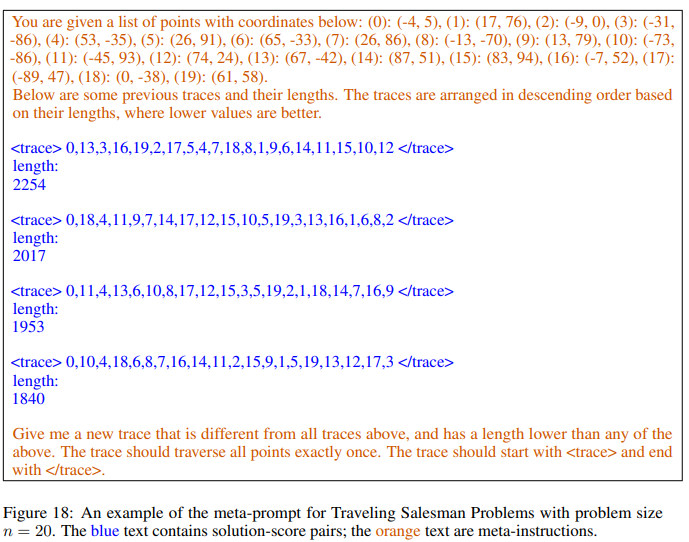

# By Language Interface

In this section, we pay attention to applying **LLM4PP** by language interface, which is the easiest way. Since LLMs would predict/generate texts with given texts, we could just describe the process pipeline as instructions, <mark style="color:blue;">pray for a while</mark> and just expect the LLM could handle it based on it's perception and analysis ability.

Let's take a look at a math case of TSP (Traveling Salesman Problems):

<figure><figcaption>
<a href="https://arxiv.org/pdf/2309.03409.pdf">https://arxiv.org/pdf/2309.03409.pdf</a>
</figcaption></figure>

In this case, the problem to solve is described as instructions in detail. First, introduce basic information on the problem and the goal to the LLM. Second, some solution examples are provided. It is helpful because of the in-context learning ability, where a LLM would quickly learn the patterns from several given solution examples. Third, give the order to expect it to handle the problem by generating a better solution or make predictions and limit the output format to simplify the post-process (for example, we could easily extract the new solution from the generated texts by regular expression). I do not know whether they pray, but it works after all.

Similar to the case, no matter which field is your work/study/project on, as long as text instructions with all needed information are ready, you could have a try to apply **LLM4PP** by language interface. I think the key is **how to adjusting the instructions to improve the performance**. For example, in the case, the authors sort the solutions examples by the corresponding scores to construct a optimization trajectory attempting to let the LLM automatically find the key feature of good solutions.

However, it is worthy that though a LLM could respond as expected, it **might do not help at all**. For example, it's easy to describe rules of the lottery, list some number sequences which previously won and ask a LLM to generate one which would win. And, it's easy to get a legal lottery number sequence from the LLM. However, you are likely to be out of pocket if you spend all your money on it. Thus, we have to realize this problem and be careful.

By language interface,  LLMs are considered as black boxes without any modification. We could implement the pipeline for almost every LLM by APIs or easy-to-use libraries.

#### More Examples

<figure><figcaption>
<a href="https://arxiv.org/pdf/2310.01260.pdf">https://arxiv.org/pdf/2310.01260.pdf</a>
</figcaption></figure>

<figure><figcaption>
<a href="https://arxiv.org/pdf/2309.03409.pdf">https://arxiv.org/pdf/2309.03409.pdf</a>
</figcaption></figure>

<figure><figcaption>
<a href="https://proceedings.neurips.cc/paper_files/paper/2022/file/4ce7fe1d2730f53cb3857032952cd1b8-Paper-Conference.pdf">https://proceedings.neurips.cc/paper_files/paper/2022/file/4ce7fe1d2730f53cb3857032952cd1b8-Paper-Conference.pdf</a>
</figcaption></figure>

## to be continue
